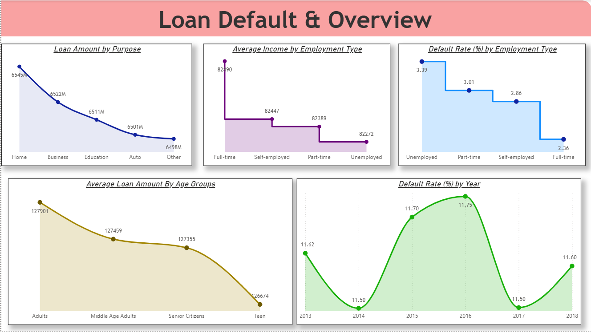
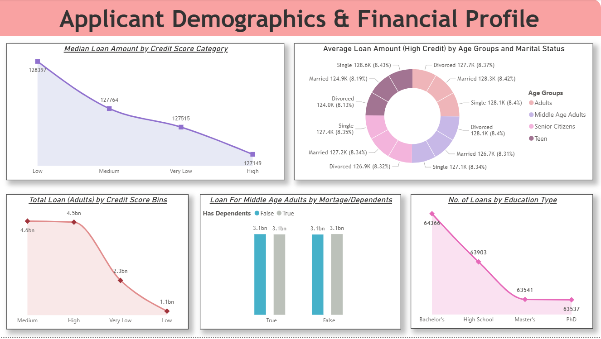
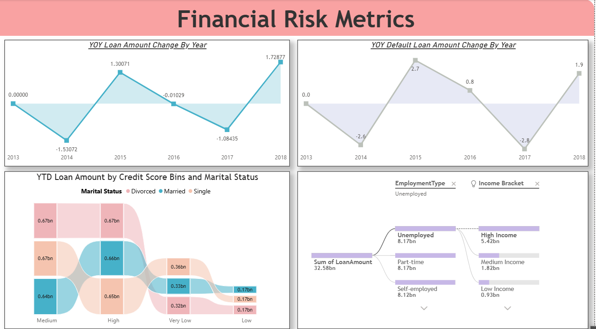

# 📊 Power BI Project – Loan Data Analysis

An end-to-end Power BI dashboard built on loan data to analyze customer trends, loan status, and repayment patterns.  
The project demonstrates data extraction from a SQL Server database, transformation through Power BI Dataflow, and visualization using DAX measures across multiple report pages.

---

## 🔗 Table of Contents
- [📘 Project Overview](#-project-overview)
- [📁 Folder Structure](#-folder-structure)
- [📦 Dataset Description](#-dataset-description)
- [📊 Power BI Report Features](#-power-bi-report-features)
- [📸 Dashboard Images](#-dashboard-images)
- [🔗 Report Link](#-report-link)
- [🛠️ Tools Used](#️-tools-used)
- [✍️ Author](#-author)

---

## 📘 Project Overview
The **Loan Data Analysis Dashboard** helps to explore loan distribution, repayment trends, and customer demographics through insightful visualizations.  
It covers the complete pipeline:  
1️⃣ Importing large-scale loan data (~2.5 lakh records) from a **MSSQL** database  
2️⃣ Creating a **Power BI Dataflow** to manage data ingestion  
3️⃣ Designing a **Power BI report with 3 pages**, using DAX measures for advanced insights

---

## 📁 Folder Structure

---

## 📦 Dataset Description
The dataset (**Loan.xlsx**) contains:
- Loan ID, Customer ID, Loan Amount, Loan Status  
- Issue Date, Due Date, Payment History  
- Customer Demographics like Age, Gender, Region  

It holds **2.5 lakh entries**, providing robust insights into loan patterns and customer behavior.

---

## 📊 Power BI Report Features
📂 [View Power BI Report](./02_PowerBI_Report/Project%201.pbix)

- Data sourced from **SQL Server** and managed through **Dataflow (Gen 1)**  
- 3 report pages exploring loan trends, repayment patterns, and customer segments  
- Custom **DAX measures** used for aggregations, KPIs, and calculated insights  
- Interactive filters & slicers for granular exploration  

---

## 📸 Dashboard Images
  
  

---

## 🔗 Report Link
🌐 [View Dashboard on Power BI](https://app.powerbi.com/links/FqZUeRRbFZ?ctid=2556ff83-cdc1-4957-9826-e36f43eedad5&pbi_source=linkShare)

---

## 🛠️ Tools Used
- **MSSQL** – Data storage & extraction  
- **Power BI Dataflow** – Data ingestion and management  
- **Power BI Desktop** – Report building  
- **DAX** – Advanced calculations and measures  
- **Power Query** – Data transformation  

---

## ✍️ Author
**Gulbaaz**  
DTU’22 | Aspiring Data & Business Analyst | SQL, Power BI, Dataflow Projects on GitHub  
📫 [GitHub Profile](https://github.com/Gulbaaz)
